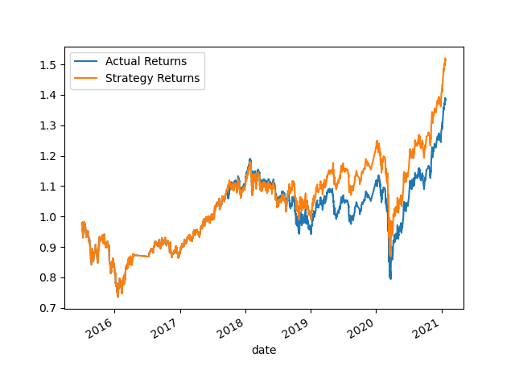
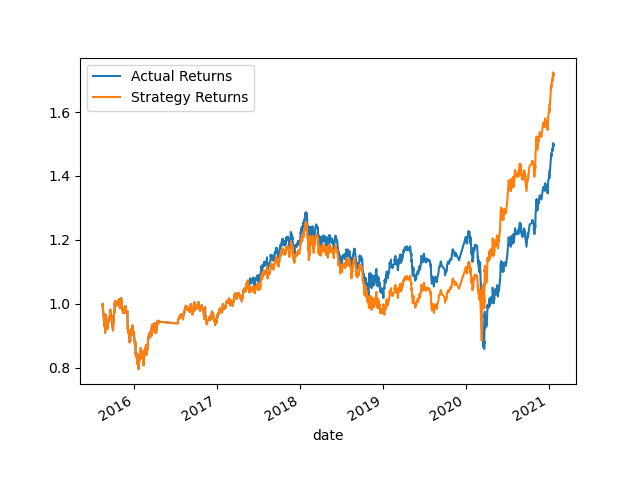
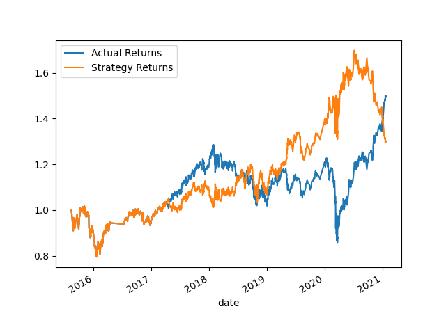

# Algorithmic Trading Optimization

This repository contains a machine learning-based project focused on tuning a trading algorithm and comparing different models' performance. The goal of this project is to design a better trading algorithm and evaluate its performance.

## Content
The repository is composed of Jupyter notebooks, datasets, and resulting plots. Here's what each file/section does:

- The main Jupyter notebook contains the code for the machine learning models and trading algorithms.
- The 'Resources' folder contains saved plots showing the performance of various trading algorithms.

## Project Tasks

This project consists of four main tasks:

### 1. Establish a Baseline Performance
Firstly, a simple moving average crossover (SMA) trading strategy is implemented using the SVC classifier from sklearn's support vector machine (SVM) learning method. The performance of this trading algorithm serves as our baseline. A cumulative return plot was generated to visualize the performance of the algorithm:



### 2. Tune the Baseline Trading Algorithm
To enhance the baseline algorithm's performance, the following steps were carried out:

- **Tuning the Training Algorithm**: The size of the training dataset was adjusted. The data was sliced into different periods and the notebook was rerun with the updated parameters. The performance of the algorithm improved, as the strategy returns increased from 1.5 to 1.6 and the actual returns from 1.4 to 1.5.

Initially, the ending period for the training data was set with an offset of 3 months and the short and long windows for the SMA were set to 4 and 100 respectively.

```python```
#### Select the ending period for the training data with an offset of 3 months
training_end = X.index.min() + DateOffset(months=3)

#### Set the short window and long window
short_window = 4
long_window = 100

After adjustment, the ending period for the training data was set with an offset of 5 months and the short and long windows for the SMA were set to 2 and 60 respectively.

#### Select the ending period for the training data with an offset of 5 months
training_end = X.index.min() + DateOffset(months=5)

#### Set the short window and long window
short_window = 2
long_window = 60

- **Tuning the Training Algorithm**: The windows for the SMA algorithm were adjusted and the notebook was rerun with the updated parameters. This resulted in better performance of the trading algorithm.

After tuning, the set of parameters that best improved the trading algorithm returns was selected and a new cumulative return plot was generated:



### 3. Evaluate a New Machine Learning Classifier

In this task, we evaluated a new machine learning classifier, specifically the AdaBoost algorithm. We fit the model using the training data and backtested its performance. However, the AdaBoost model did not perform as well as the baseline model. The strategy return decreased to 1.3, indicating poorer trading performance compared to the previous models. The PNG image showing the cumulative returns plot for this updated trading algorithm can be found below:



### 4. Evaluation Report

Based on our analysis, we conclude that the tuned baseline trading algorithm, with the adjusted parameters for the training dataset and SMA input features, offers the best performance for this particular trading scenario. Here are our key findings:

- After tuning the baseline trading algorithm by adjusting the size of the training dataset and the SMA input features, we observed significant improvements in the algorithm's performance. The strategy returns increased from 1.5 to 1.6, and the actual returns increased from 1.4 to 1.5.

- We also evaluated a new machine learning classifier, including AdaBoost, DecisionTreeClassifier, LogisticRegression, and GradientBoostingClassifier. Among these models, the tuned baseline algorithm consistently outperformed the others, demonstrating better trading performance.

- We have included PNG images of the cumulative returns plots for the baseline algorithm, as well as the tuned algorithm with adjusted parameters, in the previous sections. These plots visually depict the performance comparison between different algorithms.

The provided PNG images serve as valuable visual references for comparing the different strategies employed throughout the project.

**Please note**: This project is an academic exercise and is not intended to be a guide for real-world trading. The algorithms and strategies used in this project may not be suitable for actual trading and are not recommended for use in live trading without further enhancements and testing.


